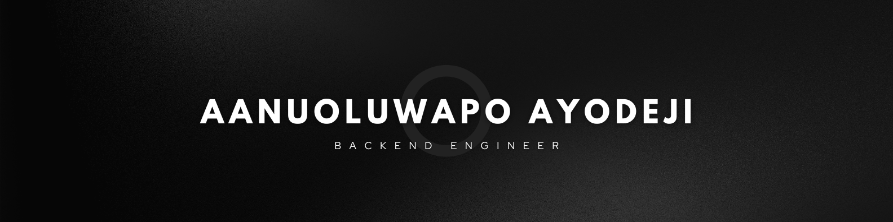
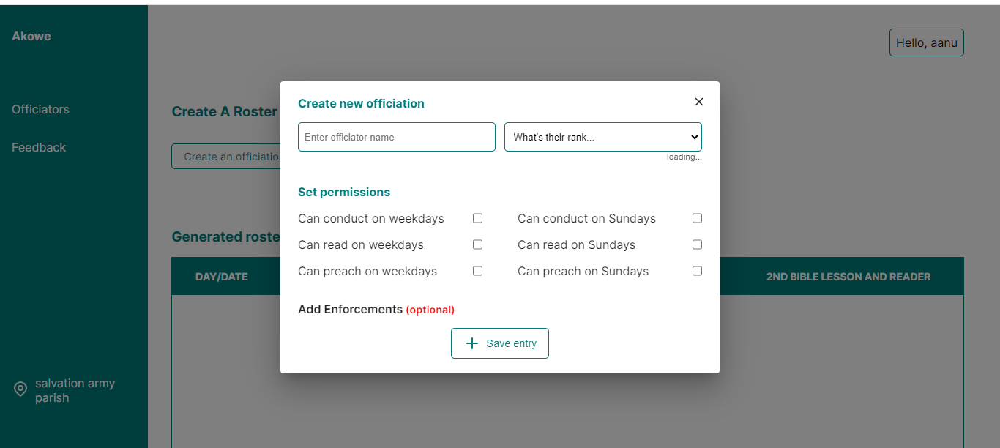
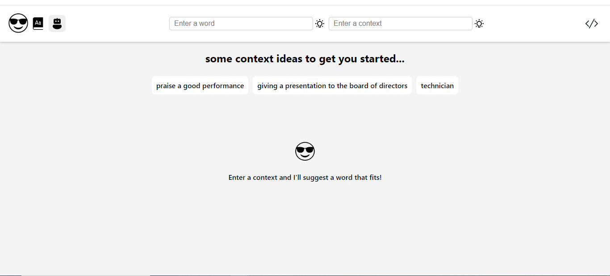
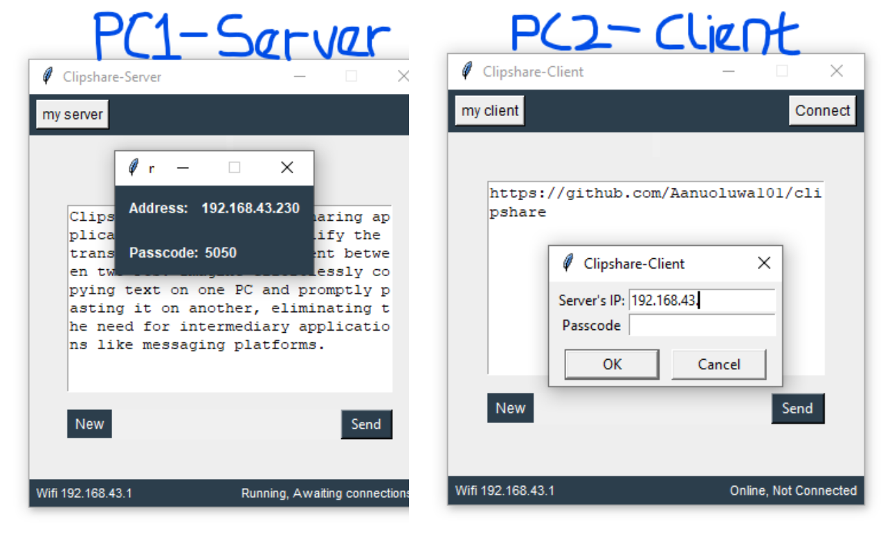

### 👋 Meet me
I'm a backend developer on a mission to build softwares that people love. Backend reminds me of the word "Backbone", and just like a solid backbone ensures stability, I strive to create reliable, scalable, and performant solutions with every line of code. I've had the opportunity of writing code that solve real-life problems, and I'm excited to keep creating solutions that truly make a difference.

      
  
   

---
### 🧰 Languages and Tools

 

#

### 🚀 Projects
<table bordercolor="#66b2b2">
  
  <tr>
    <td width="50%" valign="top">
      <h3 align="center">Akowe</h3>
         
        
         
        

          
    
  
      

        
<strong>Python, Django, Djangorestframework, postgres & Next.js</strong> - An algorithm-powered, service roster-generation tool for Celestial churches (a Christian denomination).

    </td>
    <td width="50%" valign="top">
      <h3 align="center">SoundSophisticated</h3>
         
      
         
        

          
  
  
      

        
<strong>Python, Flask, MongoDB & React.js</strong>An AI web app that helps users improve their vocabulary by helping them learn new words in contexts of their choosing.

    </td>
  </tr>
    <tr>
    <td width="50%" valign="top">
      <h3 align="center">Clipshare</h3>
         
        
         
        

          
    
      

        
<strong>Python, tkinter</strong>A desktop application for sharing clipboard content between two PCs.

    </td>
</table>

 

#

### 📞 Contact me 
📧 aanuayodeji101@gmail.com  
🌐 https://aanuoluwapoayodeji.onrender.com/

